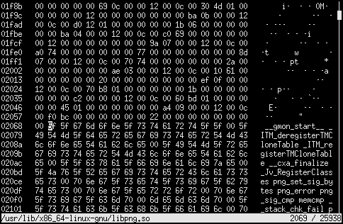

hex.py
======

Simple ncurses hex viewer/editor.

Features:

 * Find byte sequences
 * Decode numbers
 * Overwrite bytes
 * Set and jump to marks
 * Supports files of any size
 * Supports Python expressions
 * Mouse support

License: Public domain
